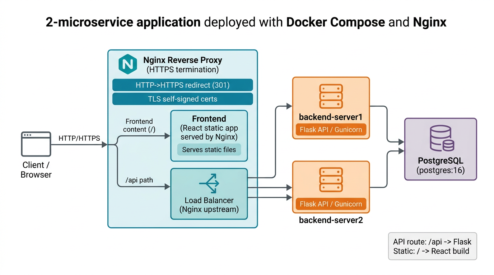
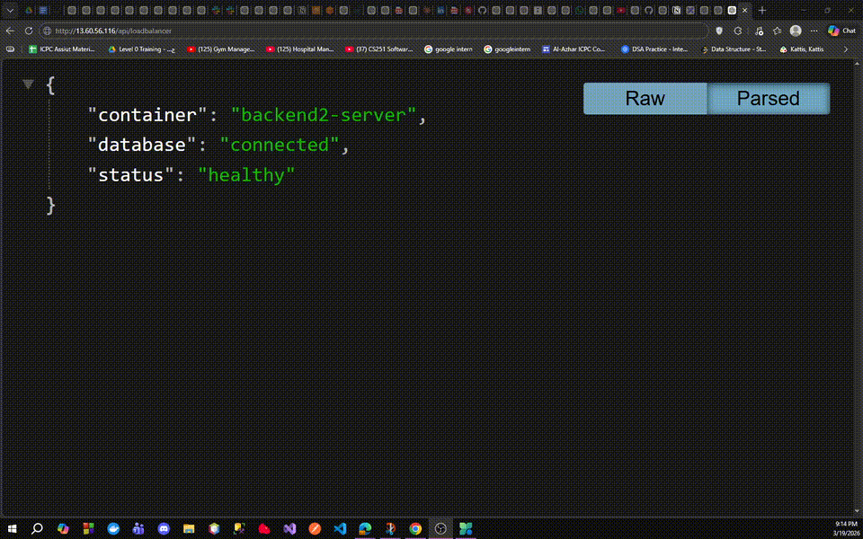
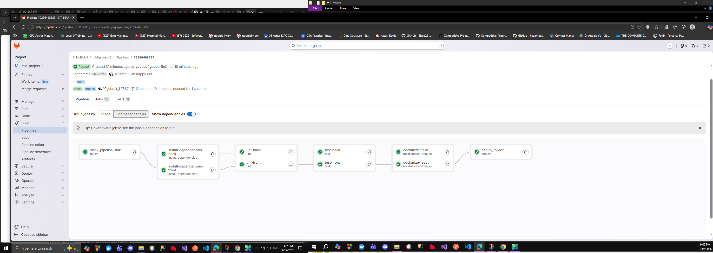
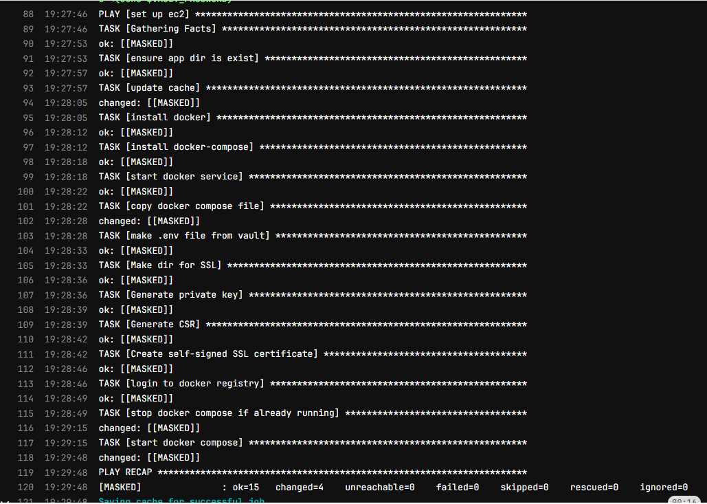
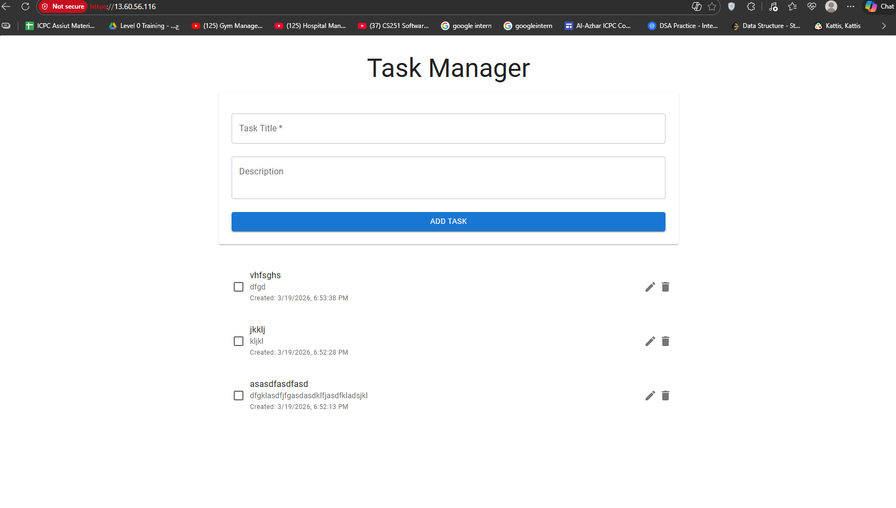

## Project Overview
This repository contains 2 microservices:

1. `backend` (Flask + SQLAlchemy) providing a REST API and persisting data in PostgreSQL.
2. `frontend` (React) compiled to static assets and served by Nginx.

For production, Nginx acts as:
- HTTPS reverse proxy for the backend API (`/api`)
- HTTP -> HTTPS redirect
- Load balancer across multiple backend containers (via Nginx `upstream`)

The CI/CD pipeline is implemented with GitLab CI:
- Lint + test both services
- Build multi-stage Docker images
- Push images to DockerHub
- Deploy to an EC2 instance using Ansible
- Send a Slack notification when the pipeline starts

Architecture overview:



## Folder Structure
The repository is organized as follows:

```text
.
├── backend/
│   ├── app.py
│   ├── entrypoint.py
│   ├── requirements.txt
│   ├── test_app.py
│   ├── Dockerfile
│   └── static/
│       └── swagger.json
├── frontend/
│   ├── src/
│   │   ├── App.js
│   │   └── index.js
│   ├── public/
│   │   └── index.html
│   ├── Dockerfile
│   ├── package.json
│   └── default.conf   # Nginx reverse proxy + HTTPS redirect + load balancer upstream
├── docker-compose-dev.yml    # Local/dev: build + run with dev topology
├── docker-compose-prod.yml   # Production: run with DockerHub images + TLS mount
├── .gitlab-ci.yml            # GitLab pipeline (lint/test/build/push/deploy + Slack notification)
├── playbook.yml             # Ansible playbook for EC2 deployment
├── vault.yml               # Encrypted vars used to generate `.env` on EC2 at deploy time
├── .env                    # Local example env values (not encrypted)
└── README.md
```

### What you built in this project
You implemented the following items end-to-end:

- Multi-stage Docker images for both microservices:
  - `backend/Dockerfile` (build venv, copy into slim image, run `entrypoint.py`)
  - `frontend/Dockerfile` (build React static files, serve them using Nginx, copy `frontend/default.conf`)
- Local and production orchestration:
  - `docker-compose-dev.yml` for development/testing of containers and networking
  - `docker-compose-prod.yml` for production-like deployment topology using DockerHub images
- Nginx configuration for production:
  - `frontend/default.conf`:
    - HTTP (port 80) redirect to HTTPS (port 443)
    - TLS termination using self-signed certs mounted at runtime
    - reverse proxy from `/api` to backend services
    - Nginx `upstream` to load balance requests across backend containers
- Load balancer verification endpoint:
  - Backend route `/api/loadbalancer` returns JSON containing the responding container hostname (used to prove requests rotate between servers).
- GitLab CI/CD pipeline:
  - Slack notification on pipeline start
  - Template-based linting/testing for both `frontend` and `backend`
  - Docker build + push to DockerHub
  - Deployment job to EC2 using Ansible and an encrypted vault
- EC2 deployment via Ansible + vault:
  - `playbook.yml` installs Docker + Docker Compose on EC2
  - copies `docker-compose-prod.yml` to the remote machine
  - decrypts `vault.yml` during deploy to generate a runtime `.env` on EC2
  - generates a self-signed TLS certificate for Nginx directly on EC2 (so the reverse proxy can run HTTPS)
  - starts (and recreates) the production containers

## Backend (`backend`)
Key features implemented in the Flask API:

- REST endpoints:
  - `GET /api/tasks` (list tasks)
  - `POST /api/tasks` (create task)
  - `PUT /api/tasks/<task_id>` (update task)
  - `DELETE /api/tasks/<task_id>` (delete task)
- Health endpoints:
  - `GET /health` (checks DB connectivity)
  - `GET /api/loadbalancer` (returns `status` + `container` hostname to validate load balancing)
- Swagger UI:
  - `GET /api/docs` served by `flask-swagger-ui`
  - Swagger JSON comes from `backend/static/swagger.json`

The backend uses environment variables from `.env`:
- `POSTGRES_HOST`, `POSTGRES_PORT`, `POSTGRES_USER`, `POSTGRES_PASSWORD`, `POSTGRES_DB`

## Frontend (`frontend`)
Frontend build + runtime behavior:

- React application uses `REACT_APP_API_URL` at build time (passed from CI via `--build-arg`).
- UI calls the backend through Axios using `${REACT_APP_API_URL}/tasks`.
- The frontend is built into static assets and served by Nginx in the same container.

## Docker Images (Multi-Stage)
### Backend image
`backend/Dockerfile`:
- Builder stage:
  - creates a Python virtual environment
  - installs dependencies into that venv
- Runtime stage:
  - copies the venv into a slim Python image
  - runs `backend/entrypoint.py` (it creates tables and starts Gunicorn)

### Frontend image
`frontend/Dockerfile`:
- Builder stage:
  - runs `npm install`
  - runs `npm run build` to create the React production build
- Nginx runtime stage:
  - serves the React build from `/usr/share/nginx/html`
  - copies `frontend/default.conf` into `/etc/nginx/conf.d/default.conf`

## Docker Compose
### Dev/Test: `docker-compose-dev.yml`
This file is meant for local testing of:
- container networking between `frontend` and multiple backend instances
- PostgreSQL connectivity

Notes:
- The frontend is exposed as `3000:80`.
- Production-style HTTPS redirect uses TLS assets mounted in prod; if you want HTTPS locally as well, you may need to also provide certificate/key files (or modify the Nginx config accordingly).

### Production: `docker-compose-prod.yml`
This file is meant for production-like runs on EC2 using DockerHub images:

- `frontend` (Nginx):
  - uses `react-service:latest`
  - exposes `80:80` and `443:443`
  - mounts the TLS cert/key generated by Ansible into the container
- `backend` + `backend2`:
  - both run the Flask API image `flask-service:latest`
  - `backend3` is commented out to reduce EC2 resource usage
- `postgres`:
  - includes a healthcheck (`pg_isready`)
- `backend` / `backend2` healthchecks:
  - checks `/api/tasks` returns HTTP 200

## Nginx Reverse Proxy + Load Balancing + HTTPS Redirect
All Nginx behavior is configured in `frontend/default.conf`:

- HTTPS redirect:
  - Requests to port `80` are redirected using `return 301 https://$host$request_uri;`
- TLS termination:
  - certificate/key paths are referenced as:
    - `/etc/ssl/certs/nginx-selfsigned.crt`
    - `/etc/ssl/private/nginx-selfsigned.key`
- Reverse proxy:
  - `location /api` proxies traffic to an Nginx `upstream` called `flask_api`
- Load balancing:
  - `upstream flask_api` lists backend servers (in this repo: `backend:5000` and `backend2:5000`)
  - Nginx distributes requests across the configured servers (round-robin by default).

## GitLab CI/CD Pipeline
Pipeline config: `.gitlab-ci.yml`

Stages you implemented:
- `notify`:
  - `slack_pipeline_start` posts a Slack message using `SLACK_WEBHOOK_URL`
- `install-dependencies`:
  - template-based installs for `frontend` and `backend`
- `lint`:
  - template-based linting for both services
- `test`:
  - template-based tests for both services
- `build-docker-images`:
  - build multi-stage images for both services
  - push tags to DockerHub (`...:latest`)
- `deploy`:
  - runs Ansible on the GitLab runner to deploy to EC2

## EC2 Deployment with Ansible + Vault
Deployment pipeline uses:
- `playbook.yml` to configure the EC2 instance and start production containers
- `vault.yml` (encrypted) to generate `.env` on the EC2 machine at deploy time

High-level steps performed by the playbook:
- Install Docker (`docker.io`) and Docker Compose (`docker-compose`)
- Create the target directory (`/home/ubuntu/app`)
- Copy `docker-compose-prod.yml` to the remote host as `docker-compose.yml`
- Create EC2 `.env` from decrypted vault variables
- Generate self-signed TLS certificate + key for Nginx on EC2
- Log into DockerHub
- Stop any existing compose stack
- Start compose and force recreate + pull images

### GitLab CI variables you need
Your pipeline depends on these environment variables being configured in GitLab CI:
- `SLACK_WEBHOOK_URL`
- `DOCKERHUB_USERNAME`
- `DOCKERHUB_PASSWORD`
- `EC2_HOST`
- `EC2_USER`
- `SSH_PRIVATE_KEY`
- `VAULT_PASSWORD`

## How to Verify Load Balancing
1. Open your application over HTTPS (e.g. `https://<EC2_IP>`).
2. Call the backend endpoint that identifies the responding container:
   - `GET https://<EC2_IP>/api/loadbalancer`
3. Repeat multiple times; responses should alternate between backend containers.

You can also use the video below as proof of the rotation behavior:

<video controls width="720" src="result-images/loadbalancer.mp4">
  Your browser does not support the video tag.
</video>




Full video (MP4): [result-images/loadbalancer.mp4](result-images/loadbalancer.mp4)


## Results / Screenshots / Video
All screenshots/logs/videos you want to include should be placed in the repository folder:
- `result-images/`

Included results:
- Pipeline screenshot(s): 
- Ansible / runner logs: 
- Application runtime screenshot: 

If your actual screenshot filenames differ, update the filenames in this README to match your `result-images/` contents.

Video note: the preview above demonstrates `http -> https` redirect and request rotation between backend containers (serve1 -> serve2 -> serve1).

